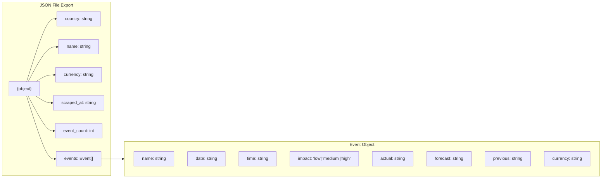
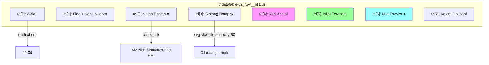

# Macro Data Scraper

Scraper data peristiwa makroekonomi dari [Investing.com](https://www.investing.com/economic-calendar/).

## Setup

```bash
pip install playwright
playwright install chromium
```

## Cara Pakai

```bash
python scraper.py
```

## Output

File JSON di `../data/macro/`:

| File | Deskripsi |
|------|----------|
| `us_macro.json` | Data peristiwa Amerika Serikat |
| `gb_macro.json` | Data peristiwa Inggris |
| `id_macro.json` | Data peristiwa Indonesia |
| `jp_macro.json` | Data peristiwa Jepang |
| `_summary.json` | Ringkasan semua negara |

## Struktur Data Export JSON

Setiap file JSON memiliki struktur yang sama. Berikut penjelasannya:



### Penjelasan Field

| Field | Tipe | Deskripsi |
|-------|------|-----------|
| `country` | string | Kode ISO negara: `US`, `GB`, `ID`, `JP` |
| `name` | string | Nama lengkap negara |
| `currency` | string | Mata uang negara: `USD`, `GBP`, `IDR`, `JPY` |
| `scraped_at` | string | Timestamp kapan data di-scrape |
| `event_count` | int | Jumlah peristiwa yang ditemukan |
| `events` | array | Array of objek Event |

### Penjelasan Field Event

| Field | Tipe | Deskripsi |
|-------|------|-----------|
| `name` | string | Nama peristiwa ekonomi |
| `date` | string | Tanggal peristiwa (format: YYYY-MM-DD) |
| `time` | string | Waktu rilis (format: HH:MM) |
| `impact` | string | Dampak: `low`, `medium`, `high` |
| `actual` | string | Nilai aktual yang dirilis ( `-` jika belum ada) |
| `forecast` | string | Nilai forecast/konsensus pasar ( `-` jika belum ada) |
| `previous` | string | Nilai periode sebelumnya ( `-` jika tidak ada) |
| `currency` | string | Mata uang terkait peristiwa |

## Contoh JSON

**us_macro.json**
```json
{
  "country": "US",
  "name": "United States",
  "currency": "USD",
  "scraped_at": "2026-04-06 08:30:29.774286",
  "event_count": 8,
  "events": [
    {
      "name": "ISM Non-Manufacturing PMI (Mar)",
      "date": "2026-04-06",
      "time": "21:00",
      "impact": "high",
      "actual": "54.8",
      "forecast": "53.5",
      "previous": "56.1",
      "currency": "USD"
    }
  ]
}
```

**_summary.json**
```json
{
  "scraped_at": "2026-04-06 08:30:29.774286",
  "countries": {
    "US": {"name": "United States", "event_count": 8},
    "GB": {"name": "United Kingdom", "event_count": 0},
    "ID": {"name": "Indonesia", "event_count": 2},
    "JP": {"name": "Japan", "event_count": 0}
  }
}
```

## Struktur HTML (Investing.com)

Scraper membaca struktur tabel HTML dari Investing.com:



### Penjelasan CSS Selector

- `tr.datatable-v2_row__hkEus` - Selector untuk setiap baris peristiwa
- `td a.text-link` - Link nama peristiwa
- `div.text-sm` - Waktu rilis
- `svg[href*="star-filled"]` - Bintang dampak (impact)
- `td.datatable-v2_cell--align-end__BtDxO` - Kolom untuk actual/forecast/previous

## Cookie Authentication

Investing.com mendeteksi automation. Agar bisa scrape, perlu cookie dari browser yang sudah login:

1. Buka Chromium ke investing.com/economic-calendar
2. Login ke akun investing.com
3. Install extension "EditThisCookie" atau export cookies manual
4. Export cookies dalam format Netscape ke file `cookies.txt`
5. Scraper akan load cookies otomatis saat dijalankan

### Format cookies.txt

```text
# Netscape HTTP Cookie File
.investing.com	TRUE	/	FALSE	1775437998	gcc	ID
.investing.com	TRUE	/	FALSE	1775437998	gsc	...
```

## Dependensi

- Python 3.14+
- playwright
- chromium (system atau install via `playwright install`)
